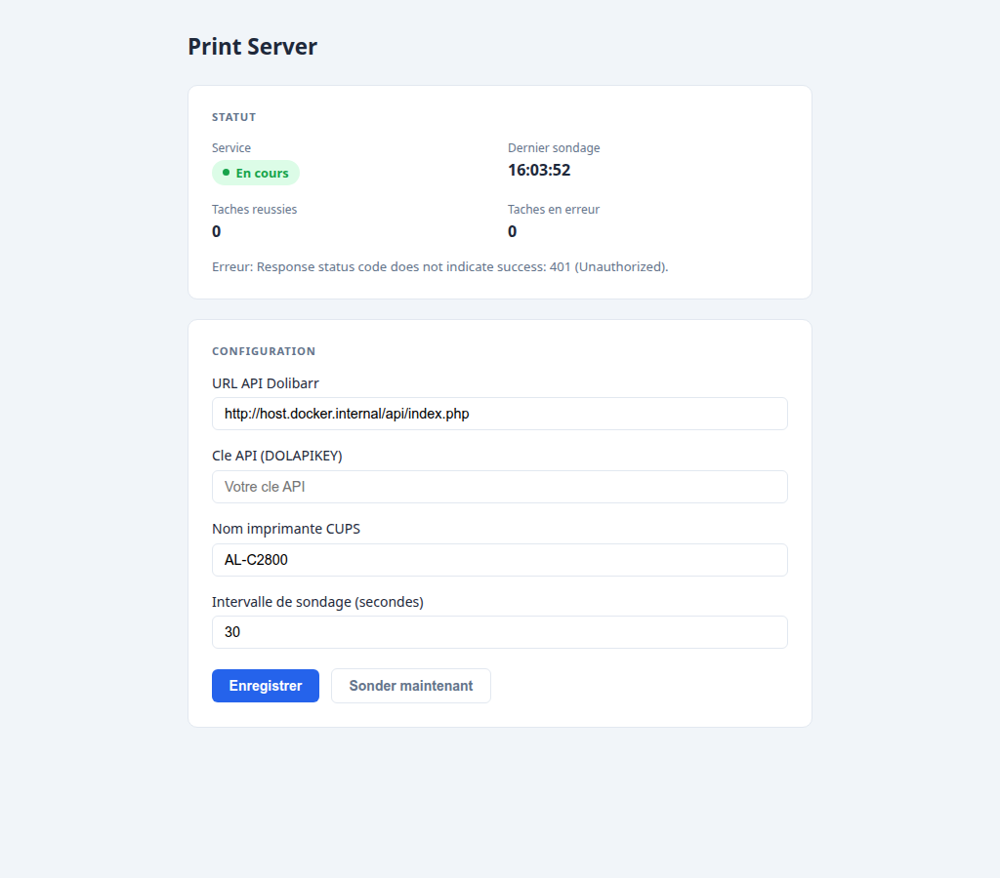
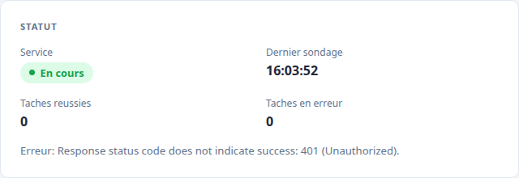
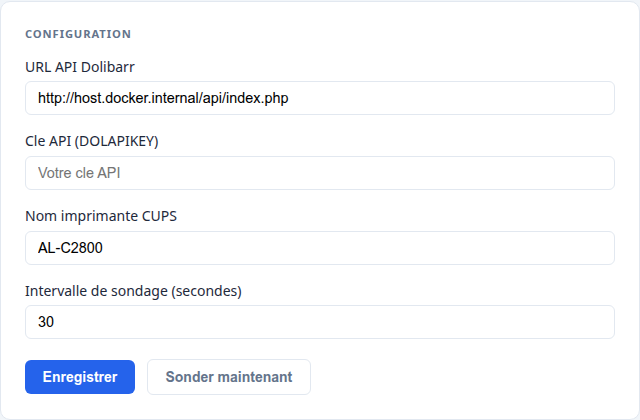

# Print Server pour Dolibarr

Service d'impression automatique pour Dolibarr. Il interroge l'API Dolibarr toutes les N secondes, télécharge les documents à imprimer et les envoie à une imprimante CUPS locale.

## Fonctionnement

```
Dolibarr (API REST)  →  Print Server  →  CUPS  →  Imprimante physique
```

1. Le service interroge `/printjobapi/printjobs` (statut = 0 = en attente)
2. Télécharge le fichier via `/documents/download` (réponse base64)
3. Envoie à l'imprimante via la commande `lp`
4. Met à jour le statut de la tâche (1 = succès, 99 = erreur)

## Prérequis

- Docker et Docker Compose
- CUPS installé sur la machine hôte avec l'imprimante configurée
- Module Dolibarr `printjobapi` installé et actif

## Déploiement

```bash
docker compose up --build -d
```

L'interface de configuration est ensuite accessible sur **http://localhost:5000**.

## Interface de configuration



### Bloc Statut

Affiché en temps réel (rafraîchissement toutes les 5 secondes).



| Champ | Description |
|---|---|
| Service | En cours (vert) ou Arrêté (rouge) |
| Dernier sondage | Heure du dernier appel à l'API |
| Tâches réussies | Compteur cumulé depuis le démarrage |
| Tâches en erreur | Compteur cumulé depuis le démarrage |

### Formulaire de configuration



| Champ | Exemple | Description |
|---|---|---|
| URL API Dolibarr | `http://host.docker.internal/api/index.php` | URL de base de l'API REST Dolibarr |
| Clé API (DOLAPIKEY) | *(masquée)* | Clé API d'un utilisateur Dolibarr |
| Nom imprimante CUPS | `AL-C2800` | Nom CUPS tel qu'affiché par `lpstat -p` |
| Intervalle de sondage | `30` | Délai en secondes entre deux vérifications |

Le bouton **Sonder maintenant** déclenche une vérification immédiate sans attendre l'intervalle.

La configuration est sauvegardée dans `temp_data/config.json` (volume Docker persistant).

## Structure

```
PrintClient/
  Program.cs                 — setup ASP.NET Core + endpoints REST
  AppConfig.cs               — modèle de configuration
  ConfigService.cs           — lecture/écriture de config.json
  PrintBackgroundService.cs  — boucle de polling et impression
  PrintStatus.cs             — état en temps réel
  wwwroot/index.html         — interface web
  Dockerfile
docker-compose.yml
temp_data/                   — config.json persisté ici (volume monté)
```

## API REST

| Méthode | Route | Description |
|---|---|---|
| GET | `/api/config` | Lire la configuration actuelle |
| POST | `/api/config` | Sauvegarder la configuration |
| GET | `/api/status` | Lire l'état du service |
| POST | `/api/poll` | Déclencher un sondage immédiat |

## Vérifier les imprimantes disponibles

```bash
# Depuis l'hôte
lpstat -p

# Depuis le conteneur
docker exec print_client_app lpstat -p
```
